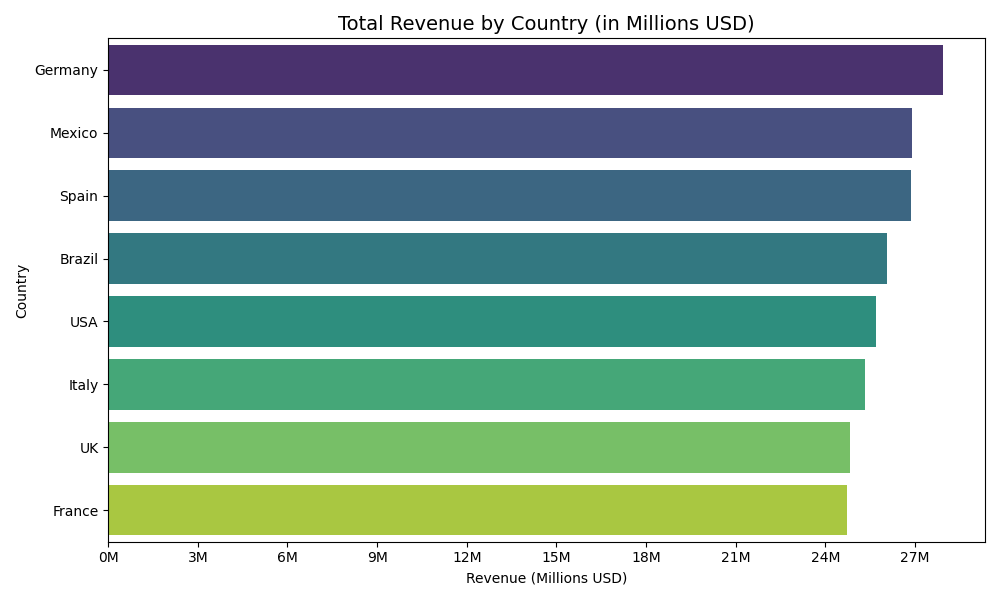
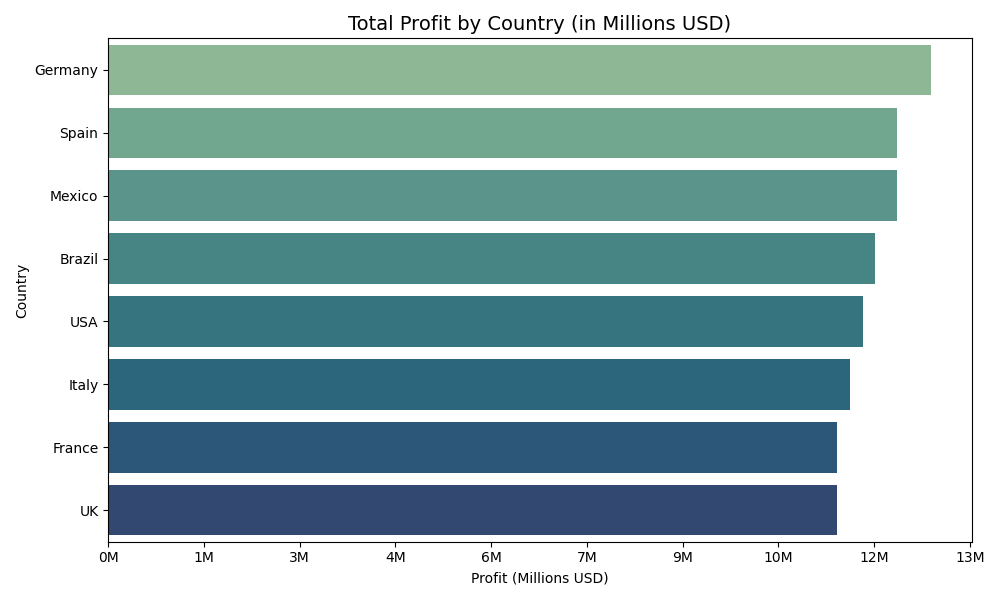
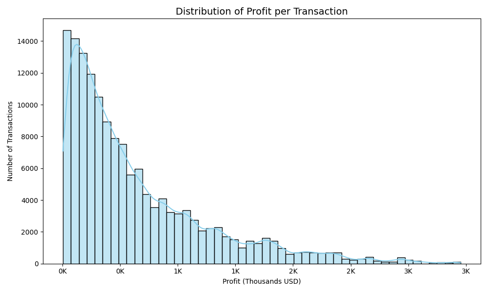
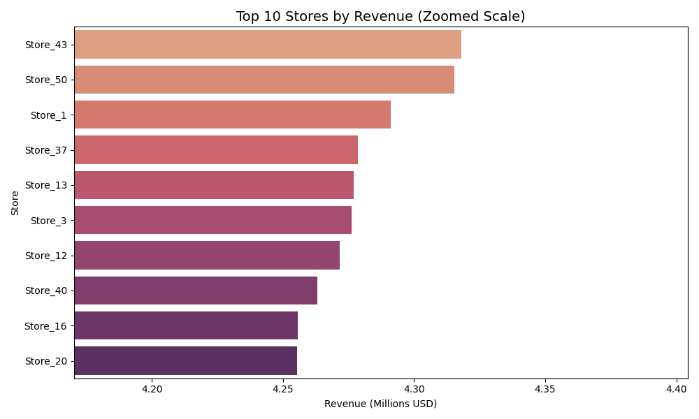
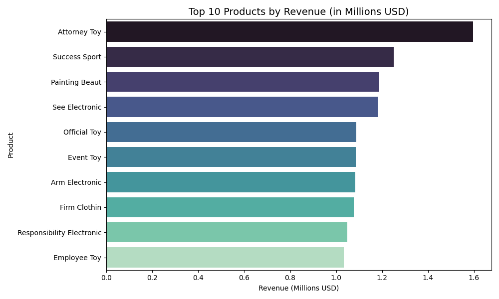
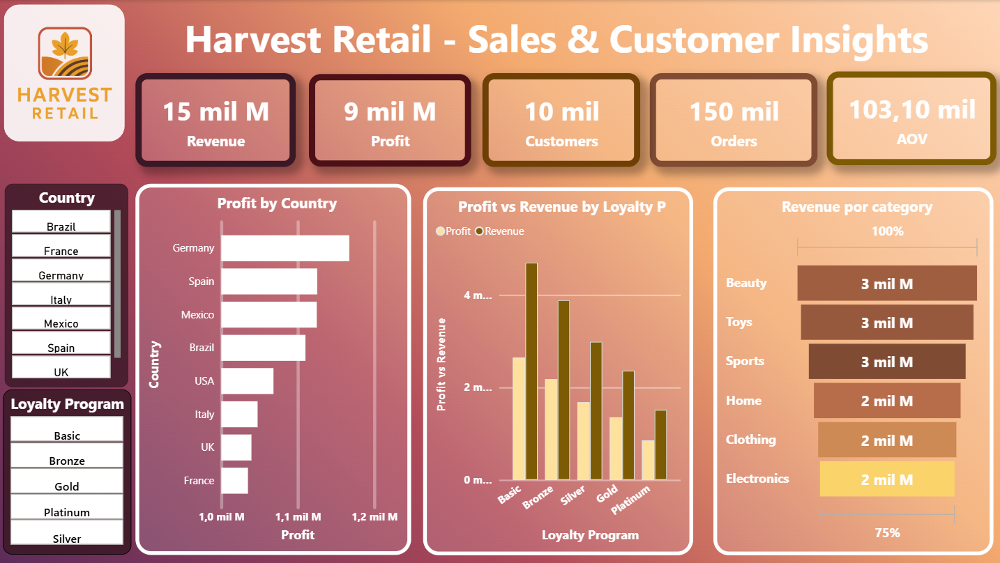
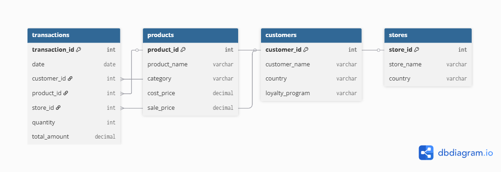

---

##  Objectives
- Design a **Star Schema** with fact and dimension tables.
- Generate and transform a **synthetic retail dataset**.
- Write **SQL scripts** for table creation, data loading, and KPI queries.
- Perform **Python analysis** with pandas, matplotlib, and seaborn.
- Build an **interactive Power BI dashboard** with key business insights.

---

##  Deliverables

1. **Data Modeling**
   - Star Schema diagram (dbdiagram.io / draw.io).
   - Fact table: Transactions.
   - Dimensions: Products, Customers, Stores.

2. **EDA (Exploratory Data Analysis)**
   - Initial EDA to validate dataset quality and business logic.

3. **SQL**
   - Table creation (DDL) and data loading (DML).
   - KPI queries: Total Revenue, Avg Order Value, Revenue by Country, Top Products.
   - KPI outputs exported as CSV in `/sql/data/outputs/`.

4. **Python**
   - Narrative business analysis with 4-5 visualizations.
     - Revenue by Country
     - Profit by Country
     - Profit Distribution
     - Top Stores by Revenue (Zoomed)
     - Top Products by Revenue

---

##  Python Analysis

Using **pandas**, **matplotlib**, and **seaborn**, I performed a narrative analysis of the retail dataset.  
The results include both global KPIs and business-focused visualizations.

### Global KPIs (calculated in Python)
- **Total Revenue:** $208,305,253.22  
- **Total Profit:** $95,892,645.81  
- **Average Order Value (AOV):** $1,388.70  
- **Number of Transactions:** 150,000  

---

### Visualizations

**1. Revenue by Country**  
Comparison of total revenue across countries.  

**2. Profit by Country**  
Highlights profitability distribution by country.  

**3. Profit Distribution**  
Histogram showing the spread of profit per transaction.  

**4. Top 10 Stores by Revenue (Zoomed)**  
Ranking of the most profitable stores, zoomed to emphasize differences.  

**5. Top 10 Products by Revenue**  
Ranking of the products that generate the most revenue.  

---

##  Power BI Dashboard

Finally, I designed an **interactive Power BI dashboard** to consolidate all insights.  
The dashboard includes KPI cards, country and loyalty program segmentation, and key product/category analyses.  

### Main Dashboard (Gradient Style)

### Key Elements
- **KPIs:** Revenue, Profit, Customers, Orders, AOV.  
- **Segmentation:** Country and Loyalty Program filters.  
- **Visuals:**  
  - Profit by Country  
  - Profit vs Revenue by Loyalty Program  
  - Revenue by Category  

*(For a more traditional version with a plain background, see `DB Harvest Retail V.1.png` in the `/images` folder.)*

---

##  Dataset Documentation

### Products
- **product_id (PK):** Unique product identifier (8-digit code, barcode style).
- **product_name:** Realistic fake product name.
- **category:** Product category (Electronics, Clothing, Home, Beauty, Sports, Toys).
- **cost_price:** Acquisition cost per unit.
- **sale_price:** Sale price per unit (always higher than cost).

### Customers
- **customer_id (PK):** Unique customer identifier (7–9 digit number).
- **customer_name:** Fake realistic customer name.
- **country:** Country of residence (USA, Spain, Germany, France, UK, Italy, Mexico, Brazil).
- **loyalty_program:** Loyalty program category (Basic, Silver, Gold, Platinum, Diamond).

### Stores
- **store_id (PK):** Unique store identifier (5-digit code).
- **store_name:** Store name (Store_1…Store_50).
- **country:** Country where the store is located.

### Transactions
- **transaction_id (PK):** Unique transaction identifier.
- **date:** Date of transaction (2023–2024).
- **customer_id (FK):** References Customers.
- **product_id (FK):** References Products.
- **store_id (FK):** References Stores.
- **quantity:** Number of units purchased.
- **total_amount:** Total sales amount (quantity × sale_price).

---
##  Star Schema
The project uses a **Star Schema** to structure the retail dataset for analytics.

- **Fact table:** Transactions (sales data).
- **Dimension tables:** Products, Customers, Stores.

---

##  Workflow
- Generate synthetic retail dataset with realistic customers, products, and stores.
- Perform **initial Exploratory Data Analysis (EDA)** to validate data quality and consistency.
- Build Star Schema for efficient querying.
- Run SQL queries to extract KPIs.
- Create Python visualizations and Power BI dashboard.

---

##  Tech Stack
- **Python** (pandas, matplotlib, seaborn)
- **SQL** (DDL, DML, KPIs)
- **Power BI** (interactive dashboard)
- **Git/GitHub** (project management)

---

##  Key Learnings
This project highlights the importance of **Data Modeling** in analytics.  
A well-designed **Star Schema** improves SQL performance, simplifies queries, and enables efficient BI reporting.

---

##  Project Status
This project is **finalized** .  
All planned deliverables (SQL, Python analysis, and Power BI dashboard) were completed successfully.

---

##  License
This project is licensed under the MIT License – see the [LICENSE](./LICENSE) file for details.
